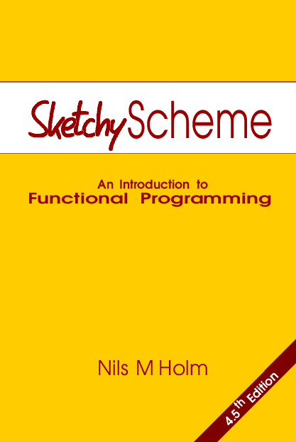

# What Next?

If you want to learn more about Scheme, here are some recommended resources:

## Scheme

* [Sketchy Scheme](https://www.t3x.org/sketchy/) by [Nils M Holm](https://www.t3x.org/)

There is a free version in Archive.org called [Sketchy Lisp](https://archive.org/details/sketchy-lisp) but I recommend latest version.

* [Structure and Interpretation of Computer Programs](https://web.mit.edu/6.001/6.037/sicp.pdf)

A classic, one of the authors of the book is the author of Scheme language.

 
<small><a href="https://commons.wikimedia.org/wiki/File:SICP_cover.jpg">Harold Abelson and Gerald Jay Sussman with Julie Sussman — MIT Press</a>, <a href="https://creativecommons.org/licenses/by-sa/4.0">CC BY-SA 4.0</a>, Wikimedia Commons</small>

I also recommend video lectures, with two versions available. The original by Abelson and Sussman from 1986 is highly recommended.

Here is the [official website of the lectures](https://groups.csail.mit.edu/mac/classes/6.001/abelson-sussman-lectures/).

They are not very good quality, but they are great, and you should have no problems in seeing the
code on the blackboard.

There are also more recent lectures from 2010 at [Berkeley](https://www.berkeley.edu/) by
[Brian Harvey](https://people.eecs.berkeley.edu/~bh/).  Only a little bit better quality.

## Lisp Macros

For more on Lisp macros, these two books are highly recommended:

* [On Lisp](https://www.paulgraham.com/onlisp.html) by [Paul Graham](https://www.paulgraham.com)

  The book is out of print, and you can download it for free. But if you prefer printed books, you
  can get it printed on Lulu Express.

  Here is article that explain how to do this:

* [Piecing Together a Printed Copy of "On Lisp"](https://www.lurklurk.org/onlisp/onlisp.html)

  You can also read this [discussion on
  Reddit](https://www.reddit.com/r/lisp/comments/l71amc/on_lisp_paperback_replica/).

* Another great book about advanced lisp macros is [Let over Lambda](https://letoverlambda.com/) by
  [Doug Hoyte](https://hoytech.com/).

## Scheme hygienic macros

**NOTE**: Unfortunately, there are no good books about Scheme hygienic macros.  But you can read
those documents:
* [Writing Powerful Macros in Scheme](https://github.com/mnieper/scheme-macros) by [Marc
Nieper-Wißkirchen](https://github.com/mnieper).
* [JRM’s Syntax-rules Primer for the Merely Eccentric](http://www.phyast.pitt.edu/~micheles/syntax-rules.pdf)
* [An Advanced Syntax-Rules Primer for the Mildly Insane](https://www.eighty-twenty.org/~tonyg/Darcs/macromod/doc/reference/petrofsky/petrofsky-advanced-syntax-rules-primer-for-the-mildly-insane.txt) by Al Petrofsky.
* Oleg Kiselyov part of the website contains [advanced usage of Scheme maros](https://okmij.org/ftp/Scheme/macros.html).

You can also find additional resources in these Reddit posts:
* [Collection of Links About Scheme Macros](https://www.reddit.com/r/scheme/comments/3chowf/collection_of_links_about_scheme_macros/)

## More Resources
You can find common recipes inside [Scheme Cookbook](https://cookbook.scheme.org/) and [more books
about Scheme](https://books.scheme.org/) on [official Scheme website](https://www.scheme.org/).
